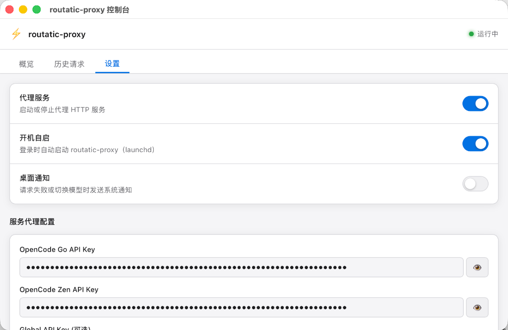

# routatic-proxy (GUI Fork Version)

[English](#english) | [中文](#中文)

---

## English

This is a fork of the `routatic-proxy` project, enhanced with a native macOS GUI interface including a System Tray menu and an embedded dashboard control panel.

### Features
- **System Tray Icon** — Easily start, stop, configure login autostart, and quit the proxy server directly from the macOS status bar.
- **Embedded Console Dashboard** — A beautiful native dashboard to view real-time request history, model metrics distribution, and manage API keys dynamically without editing config files.
- **DMG Installer** — Packaged into a standard macOS app with custom icons and launch support.
- **Hot Reload Config** — Dynamically reloads routing configurations when they are saved.

### Screenshot



### Quick Start

1. **Download & Install**: Download the `.dmg` installer from the **Releases** tab of this repository, open it, and drag `RoutaticProxy.app` to your Applications folder.
2. **Launch GUI**: Double-click `RoutaticProxy.app` to launch it. The system tray icon (⚡) will appear in your macOS status bar. Click **Open Console** to configure your API keys.
3. **Configure Claude Code**:
   ```bash
   export ANTHROPIC_BASE_URL=http://127.0.0.1:3456
   export ANTHROPIC_AUTH_TOKEN=unused
   ```
4. **Run Claude**: Run `claude` in your terminal.

### CLI Usage
If running from the command line, launch the GUI using:
```bash
routatic-proxy ui
```

---

## 中文

这是 `routatic-proxy` 项目的 Fork 增强版本，额外提供了 macOS 原生图形界面支持（系统托盘 + 内嵌控制台面板）。

### 功能特点
- **系统托盘图标** — 直接在 macOS 顶部状态栏中快捷控制代理服务的启动、停止、开机自启和退出。
- **内嵌控制台面板** — 极简的原生窗口，支持查看实时历史请求列表、模型调用分布，并且无需手动编辑 JSON 配置文件，即可直接在界面中修改和保存 API Key。
- **DMG 一键安装包** — 提供标准的 macOS 应用程序打包，带有关机自启与双击运行托盘支持。
- **配置热加载** — 支持在界面或文件中修改配置后，代理服务实时无感应用最新配置。

### 界面截图


### 快速开始

1. **下载与安装**：在此仓库的 **Releases** 页面下载编译好的 `.dmg` 安装包，双击打开并拖拽 `RoutaticProxy.app` 到您的“应用程序”文件夹中。
2. **启动软件**：双击运行 `RoutaticProxy.app`，macOS 顶部状态栏会出现闪电图标 (⚡)。点击菜单中的 **“打开控制台…”** 进入配置面板填写您的 API Key。
3. **配置 Claude Code 环境变量**：
   ```bash
   export ANTHROPIC_BASE_URL=http://127.0.0.1:3456
   export ANTHROPIC_AUTH_TOKEN=unused
   ```
4. **启动 Claude**：在您的终端运行 `claude` 即可开始使用。

### 命令行运行
如果您在命令行中运行，可以通过以下子命令唤起 GUI：
```bash
routatic-proxy ui
```

---

## Original License

[AGPL-3.0](LICENSE)
